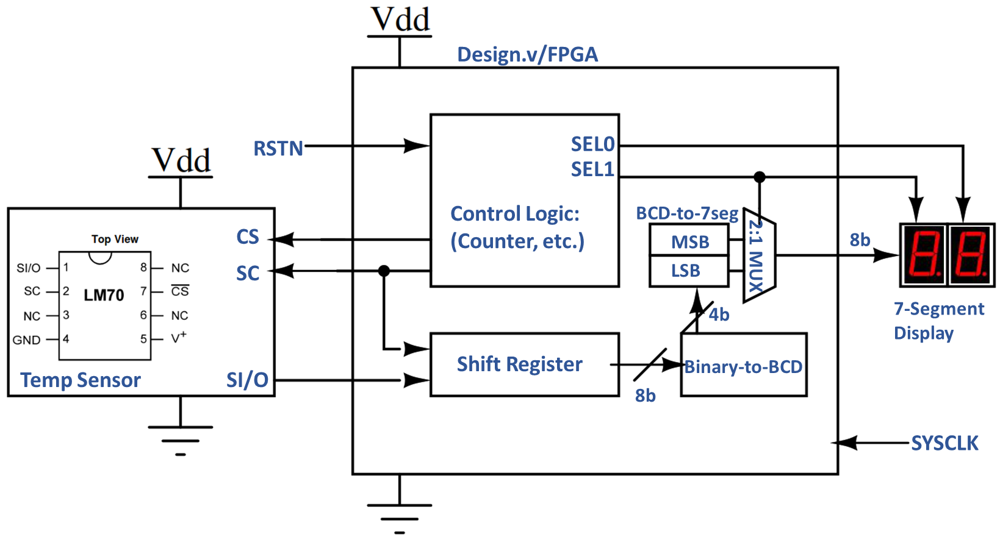

# VLSI-2024
Portal for 2024 SIT batch being mentored at the Advnaced VLSI Lab.

# TABLE OF CONTENT

- [Resources](#RESOURCES)
  - [Reference](#References)
- [Tasks & Assignments](#TASKS-and-ASSIGNMENTS)
- [Projects](#projects)
  - [SPI-based TEMPERATURE MONITOR](#SPI-based-TEMPERATURE-MONITOR)
  - [Temperature and Humidity Monitor](#TEMPERATURE-and-HUMIDITY-MONITOR)
  - [A Simple 8-bit MIPS Microprocessor](#A-SIMPLE-8-bit-MIPS-MICROPROCESSOR)
- [Electronic Design Automation (EDA) Software](#ELECTRONIC-DESIGN-AUTOMATION-SOFTWARE)
  - [Installing Icarus Verilog with GTKWave](#INSTALLING-ICARUS-VERILOG-with-GTKWAVE)

# RESOURCES

## References
- [**Mano**] Mano, M. Morris, and Michael D. Ciletti. **Digital Design**: With an Introduction to the **Verilog** HDL. Pearson, 2012. [`DBURL/s/54xsb46wcj6hdn9/ManoCiletti-DigitalDesignWithIntroToVerilog-5thEd-2012.pdf`]. -- Classic text on digital theory with a nice intro to HDL. 
- [**West**] Weste, Neil, and David **Harris**. **CMOS VLSI Design**: A Circuits and Systems Perspective. Pearson Education, 2011. [`DBURL/s/ard8jntcpq1pt45/Weste-Harris-CMOS-VLSI-design-Pearson-4thEd-2011.pdf`] -- An excellent reference on Digital VLSI design and VLSI design process as well.
  - [**Web Companion**] http://pages.hmc.edu/harris/cmosvlsi/4e/index.html
- [**Kang**] Leblebici, Yusuf, Chul Woo Kim, and Sung-Mo (Steve) Kang. **CMOS Digital Integrated Circuits Analysis & Design**. 4th ed. McGraw-Hill Education, 2014. [`DBURL/s/axtrki5yilzg8zs/Kang-CMOS-DigitalIC-4thIE-McGrawHill-2015.pdf`] -- Classic text on CMOS VLSI Design.
- [**Hodges**]] Hodges, David A., and David. **Analysis And Design Of Digital Integrated Circuits**, In Deep Submicron Technology (Special Indian Edition). Tata McGraw-Hill Education, 2005. [`DBURL/s/olc3j7hkarlwila/HodgesJackson-DesignAndAnalysisOfDigitalIC-3Ed-McGraw-2005.pdf`]. -- Another classic text on CMOS VLSI Design.
- [**Palnitkar**] Palnitkar, Samir. **Verilog HDL**: A Guide to Digital Design and Synthesis. Prentice Hall Professional, 2003. [`DBURL/s/h5qxwwff3qxl58z/PalnitkarSamir-VerilogHDL-2ndEd-2003.pdf`]. -- Classic text on Verilog.
- [**Mishra**] Mishra, Kishore. **Advanced Chip Design**: Practical Examples in Verilog, 2013. [`DBURL/s/qb3rm97rqvri6my/MishraKishore-AdvancedChipDesign-Verilog.pdf`]. -- Lots of Verilog examples.


# TASKS and ASSIGNMENTS

- [23 Dec 2022]: 
  - Research and understand the I2C protocol. You can start with some of the links provided below.
  - Create a Verilog model for the [DHT20](https://www.dropbox.com/s/h3shzfsain3r9li/datasheet-temp-humidity-5193-DHT20.pdf) temp & humidity sensor.
  - Continue with the Verilog lessons from chipverify.com
- [21 Sep 2022]: Follow the first 8 lessons in this [GitHub page](https://github.com/silicon-vlsi-org/module-cs3-301) to get familiar with and improve your skill in using Unix/Linux commands. You can use any Linux machine (webinal or your Virtual Box) to complete the assignement.  

# PROJECTS

## SPI-based TEMPERATURE MONITOR

This project will aim at design and immplemention of a SPI-based temperature monitor. The students will design a controller in Verilog to read the data from the sensor ([LM70][datasheetLM70]) using the industry-standard SPI protocol, convert the data to a human readable format (deg-C) and drive a set of 7-segment display to display the data. In order to test the Verilog code in realtime application, the Verilog code will be synthesized into a Xilinx's Spartan FPGA board. This will allow the students to test their Verilog code in real time.



**SOME USEFUL LINKS**

- [An easy-to-read SPI tutorial from sparkfun](https://learn.sparkfun.com/tutorials/serial-peripheral-interface-spi)
- [Datasheet: TI SPI-based temperature sensor LM70][datasheetLM70]
- [Technical Reference: Xilinx Spartan-6 FPGA Development Board][TechRefSpartan6]

:exclamation: **TASKS:** :exclamation:
- :one: Convert the shift register code to a compact format like this `shift_reg <= shifte_reg<<1;` 
- :two: Latch the 8-bit output from the LM70 to `outreg[7:0]` at the end of read cycle and verify you the value is the same as set in the temperature sensor.
- :three: Follow [chipverify.com](https://www.chipverify.com/verilog/verilog-tutorial) excercises till the __Behavioural modeling__ section. Now you can use iverilog to complete the assignments.
 

## I2C-based TEMPERATURE and HUMIDITY MONITOR

This project will aim at design and immplemention of a temperature & humidity monitor. The students will design a controller in Verilog to read the data from the sensor ([DHT20](https://www.dropbox.com/s/h3shzfsain3r9li/datasheet-temp-humidity-5193-DHT20.pdf)), convert the data to a human readable format (deg-C and Rh-%) and drive a set of 7-segment display to display the data. In order to test the Verilog code in realtime application, the Verilog code will be synthesized into a Digilent [Arty A7 FPGA development board](https://digilentinc.com/start/ArtyA7). This will allow the students to test their Verilog code in real time.

**SOME USEFUL LINKS**

- [An easy-to-read I2C tutorial from sparkfun](https://learn.sparkfun.com/tutorials/i2c/)
- [An detail IC implementation of a I2C controller](https://github.com/vsao/I2C)
- [Datasheet: DHT20 Temperature & Humidity Sensor](https://www.dropbox.com/s/h3shzfsain3r9li/datasheet-temp-humidity-5193-DHT20.pdf)
- [Arty A7 FGPA Development Board Resources](https://digilentinc.com/start/ArtyA7)

## A SIMPLE 8-bit MIPS MICROPROCESSOR

For this project we will design and immplement a 8-bit subset of the MIPS microprocessor architecture as outlined in [**Weste**] Chapter 1.7 as an example case study. The major development steps for this project will be:
- Study chapter 1.7, understand it **well** and prepare a short presentation summarizing the project. 
- Create a behavioural model in Verilog of the whole microprocessor and test it with a machine code of a simple program.
- Create structural models of each sub-system of the processor using Verilog structural flow using a basic set digital gates.
- Verify each subsystem and the entire processor using the structural models.
- Design, layout and characterize each of the digital gates used in the processor using SKY130 technology.
- Back annotate the chracterized delays into the Verilog models and do timing checks and find the highest frequency of operation.


# ELECTRONIC DESIGN AUTOMATION SOFTWARE

## INSTALLING ICARUS VERILOG with GTKWAVE

In this section we will demonstrate on how to install the open-source Verilog simulator **Icarus Verilog** (`iverilog`) and view the result using an open-source viewer **GTKWave**. 

**SOME USEFUL LINKS**:
- [iVerilog creator Steve Icarus's document page](https://steveicarus.github.io/iverilog)


The following instructions are for `iverilog` and `gtkwave` from a standard **Ubuntu 18.04** repository:

- `sudo apt update && sudo apt upgrade -y` : To update your distribution.
- `sudo apt install iverilog`
- `sudo apt install gtkwave`
- Now let's compile a simple verilog module and it's testbench: `mydut.v` and `tb_mydut.v`. An example contnet of the Verilog code is given below.
  - Create project directory say `mkdir -p ~/iverilog/test` and `cd` to that directory.
  - `iverilog -o tb_mydut.vvp mydut.v tb_mydut.v` : Compile the verilog codes and create an output `tb_mydut.vvp`
  - `vvp tb_mydut.vvp` : Convert the compiled output to a VCD format for GTKWave.
  - `gtkwave dump.vcd` : Note: the filename `dump.vcd` is assumed to be in `tb_mydut.v`

- If you want to execute the first two commands as script, you can add the first two commands to a file called say `run`:

```bash 
iverilog -o tb_mydut.vvp mydut.v tb_mydut.v
vvp tb_mydut.vvp
```

- Now mamke the file executable by typing the follwoing command: `chmod +x run`
- And from now on, you can simply execute the script by typing `./run`

- Example content of `mydut.v`:

```verilog
// Simple DUT with NAND expression 
module mydut ( input A, input B, output Y);
  assign Y = ~(A & B);
endmodule
```

- Example content of `tb_mydut.v` :

```verilog
module tb_mydut;
  reg A;
  reg B;
  wire Y, Z;
  
  mydut dut0 (.A(A), .B(B), .Y(Y));
  
  initial begin
    // Dump waves
    $dumpfile("dump.vcd");
    $dumpvars(1);
    
    A <= 0;
    B <= 0;
    #2 
    A <= 0;
    B <= 1'bx;
    #2
    A <= 1;
    B <= 1'bz;
    #2
    A <= 1;
    B <= 1'bx;
    
   #2 $finish;
  end
endmodule
```

* * *

[datasheetLM70]:	https://www.dropbox.com/s/ot6h1511lpuxlmx/datasheet-LM70-TI-tempSensor.pdf	
[datasheetDHT20]:	https://www.dropbox.com/s/9vpyqqnqopvtvbh/datasheet-temp-humidity-5193-DHT20.pdf
[TechRefSpartan6]:	https://www.dropbox.com/s/s53w0m665e083ni/AHMY_SP6LX9_LT_Spartan6-TechRef.pdf
